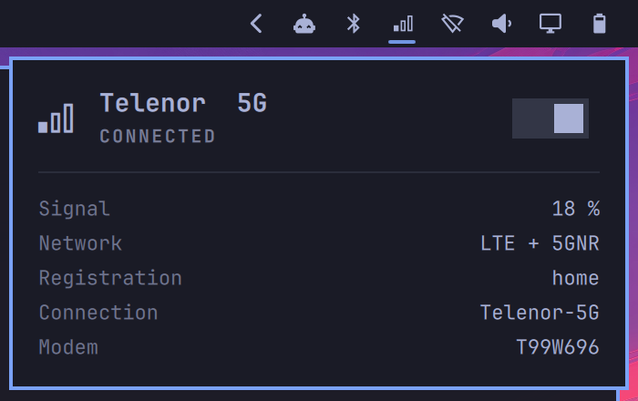

# Modem — Omarchy bar widget

Shows mobile broadband (5G/LTE) status from ModemManager in the Omarchy bar.



- Bar icon shows signal strength (0–3 bars); dimmed when not connected, crossed out when the radio is off or no modem is found.
- Left click opens a panel with operator, network type, signal, registration, connection and modem model.
- Right click (or the switch in the panel, or `c`/Enter) brings the NetworkManager GSM connection up or down. `r` refreshes.

Requires `ModemManager`, `NetworkManager` (with a `gsm` connection configured) and `jq`.

## Install

```bash
omarchy plugin add https://github.com/magnus996/omarchy-modem.git --enable
omarchy bar move magnushj.modem --section right --index 3
```

Settings: `refreshIntervalSec` (default 15).

IPC: `omarchy-shell magnushj.modem status|refresh|toggleConnection|open|close`.

## Modem shows "Radio off"? (FCC lock)

Many laptop 5G/LTE modems ship FCC-locked: ModemManager sees the modem, but
the radio refuses to power on (`mmcli -m any` shows `power state: low`, and the
ModemManager log says `Cannot power-up: software radio switch is OFF`). The
modem must be unlocked before this widget has anything to show.

- **Lenovo ThinkPads** (e.g. Foxconn T99W696 / Snapdragon X6x, Fibocom, Quectel):
  install Lenovo's unlock tool and restart ModemManager:
  ```bash
  yay -S lenovo-wwan-unlock
  sudo systemctl enable --now lenovo-cfgservice.service
  sudo systemctl restart ModemManager
  ```
- **Other vendors:** ModemManager ships unlock scripts in
  `/usr/share/ModemManager/fcc-unlock.available.d/`. Symlink the one matching
  your modem's `vid:pid` into `/etc/ModemManager/fcc-unlock.d/`, then restart
  ModemManager. See the [ModemManager FCC unlock docs](https://modemmanager.org/docs/modemmanager/fcc-unlock/).

Also make sure WWAN is enabled (`nmcli radio wwan on`, `rfkill list`) and that
`ModemManager` is enabled (`sudo systemctl enable --now ModemManager`).
